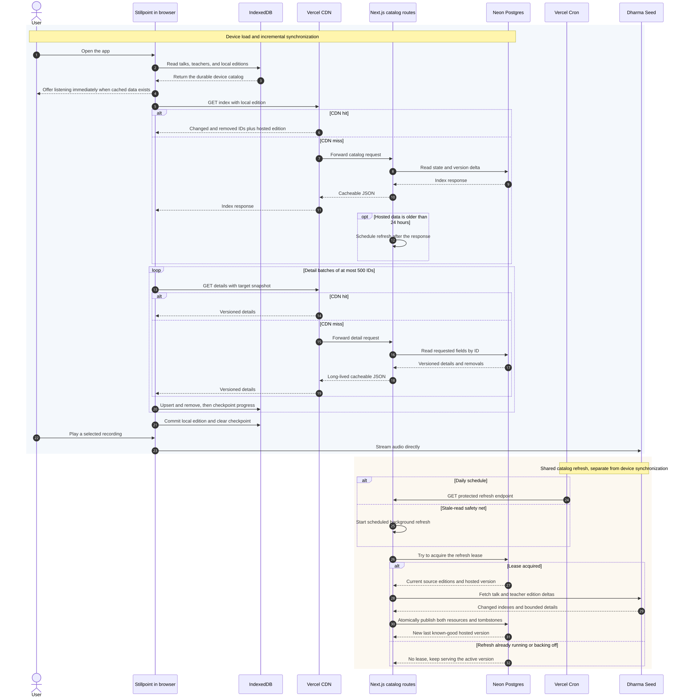

# Catalog caching and data flow

This guide is the shortest path to understanding how Stillpoint gets catalog metadata from Dharma Seed onto a phone without making every phone rebuild the catalog from the upstream service. It starts with the three storage layers, then adds synchronization, refresh behavior, and operational details.

The central idea is:

> Neon holds the shared catalog, Vercel serves bounded pieces of it, and IndexedDB keeps the device's working copy.

None of these layers carries personal listening data, and none of them carries audio.

## 1. The three catalog layers

| Layer             | What it stores                                                                                  | Lifetime and scope                 | Main job                                                                                    |
| ----------------- | ----------------------------------------------------------------------------------------------- | ---------------------------------- | ------------------------------------------------------------------------------------------- |
| Neon Postgres     | One normalized current copy of public talks and teachers, catalog state, and removal tombstones | Durable and shared by all devices  | Decouple normal app use from Dharma Seed availability and avoid repeated upstream downloads |
| Vercel CDN        | JSON responses from the catalog route: small indexes and bounded detail batches                 | Disposable, shared HTTP cache      | Absorb repeated reads of the same hosted catalog data                                       |
| Browser IndexedDB | Talks, teachers, local editions, classification version, and an interrupted-sync checkpoint     | Durable per browser profile/device | Make selection fast and offline-capable and make returning syncs incremental                |

It is useful to distinguish these from nearby storage:

- Dharma Seed is the upstream source of public metadata and the direct source of audio. It is not queried during ordinary random selection.
- The service worker Cache Storage contains the application shell. It deliberately does not intercept `/api/` requests; catalog durability belongs to IndexedDB.
- `localStorage` contains private device state such as favorites, shuffle history, last-played talk, and playback position. This data is not copied into Neon.
- Audio streams directly from Dharma Seed. It does not pass through Neon or a Vercel function.

## 2. What happens when the app opens

The browser takes a local-first path:

1. `useCatalog` opens IndexedDB and reads the locally available teachers and talks.
2. If that copy is usable, the interface can offer a recording before network synchronization finishes.
3. In the background, the client requests a teacher index and then a talk index from `/api/catalog/{resource}`, sending the device's local catalog edition.
4. The index contains only IDs changed since that edition plus IDs removed since that edition. An empty or incompatible edition produces a full index.
5. The client fetches the indicated details in batches of at most 500 IDs. Each detail URL includes the target snapshot version.
6. Each batch is validated, written to IndexedDB, and recorded in a replay-safe checkpoint. After all batches succeed, the new local edition is committed and the checkpoint is cleared.

Normal random selection, filtering, and playback use the in-memory catalog loaded from IndexedDB. They do not make database queries.



The editable source is [catalog-cache-sequence.mmd](diagrams/catalog-cache-sequence.mmd). Regenerate it with:

```sh
mmdc -i docs/diagrams/catalog-cache-sequence.mmd -o docs/diagrams/catalog-cache-sequence.svg -b transparent -w 1600
```

## 3. Why there are two kinds of version

There are two related version systems at different boundaries:

- **Dharma Seed editions** are opaque upstream tokens for talks and teachers. The hosted refresh sends them back to Dharma Seed so that an ordinary daily refresh downloads only upstream changes.
- **The hosted catalog version** is a monotonically increasing integer owned by this application. It advances only after all talk and teacher changes have been validated and published successfully.

Every current catalog row records the hosted version at which it last changed. A removal tombstone records the version at which an ID disappeared. Given a device edition of `N`, Neon can therefore return all rows and tombstones with a version greater than `N` without retaining a complete snapshot for every day.

The version in a detail URL is also important to Vercel caching. A URL such as:

```text
/api/catalog/talks?ids=12,34&snapshot=27
```

identifies hosted version 27 as the client's synchronization target. It is a cache-key boundary rather than a historical database query: the route reads the active catalog, and the client checks that the returned edition still matches its index before committing anything locally.

## 4. How the hosted catalog is refreshed

There are two entry points into the same refresh implementation:

- Vercel Cron calls the protected refresh route daily at 03:17 UTC.
- A catalog route that observes a last successful refresh more than 24 hours old schedules a refresh after returning its response.

The request-triggered path is a safety net, not a refresh on every request. A database lease allows only one refresher to proceed. A failed attempt sets a one-hour retry boundary so ordinary traffic cannot create a retry storm.

Once it has the lease, the refresher:

1. Reads the last successful Dharma Seed editions from `catalog_state`.
2. Fetches the upstream talk and teacher indexes sequentially.
3. Fetches changed details in bounded batches and normalizes them through the Dharma Seed integration boundary.
4. Publishes talk changes, teacher changes, and removals in one database transaction.
5. Advances the hosted version only if the initial catalog or a real change was published.

If downloading, parsing, validation, or publication fails, the previous Neon version remains active. Devices can keep reading the last known-good hosted catalog, while devices with IndexedDB data can also keep using their local copy.

The first full import is intentionally an operator task. It can take longer than a serverless request and should be run with `pnpm catalog:refresh` from a trusted workstation. Subsequent refreshes normally use the upstream edition deltas.

## 5. What Vercel caches

The catalog route sets different CDN policies for mutable indexes and version-addressed details:

| Response                                 | `Cache-Control` intent                                   | Reason                                                                                                                |
| ---------------------------------------- | -------------------------------------------------------- | --------------------------------------------------------------------------------------------------------------------- |
| Index or unversioned details             | `s-maxage=300`, then `stale-while-revalidate=86400`      | Index contents can change when a new hosted version is published, so shared freshness is short                        |
| Details with `snapshot <= activeVersion` | `s-maxage=31536000`, then `stale-while-revalidate=86400` | Every new target version gets new detail URLs, so earlier successful batches cannot leak into a later synchronization |
| Errors and the refresh route             | `no-store`                                               | Failures and operational responses must not become shared cached results                                              |

All successful catalog responses use `max-age=0`, so a browser HTTP-cache copy is immediately stale rather than becoming another long-lived catalog owner. IndexedDB is the explicit durable browser cache.

On a CDN miss, the Next.js route reads only the requested index or detail fields from Neon. Database credentials remain server-side. Vercel removes its CDN-specific `s-maxage` directive before the response reaches the browser and uses the full request URL, including query parameters, as the cache key.

## 6. Browser synchronization and recovery

IndexedDB contains three object stores: `talks`, `teachers`, and `metadata`. The metadata store holds each resource's edition and any pending synchronization checkpoint.

A checkpoint captures the base edition, target edition, exact ID list, and completed offset. This makes interrupted batches idempotent and resumable. A later index that describes different work invalidates the checkpoint and safely replays from the start. Removals win over updates, and the client refuses to advance its edition unless every requested ID is accounted for by either an item or an explicit removal.

Web Locks serialize synchronization between tabs when the browser supports them. The UI retries transient failures twice with bounded exponential delay, and also exposes manual and reconnect retries.

The practical failure behavior is:

| Failure                                       | Existing device                                                     | New device                                                                  |
| --------------------------------------------- | ------------------------------------------------------------------- | --------------------------------------------------------------------------- |
| Offline or Vercel unavailable                 | Uses IndexedDB; audio still needs a network connection              | Cannot prepare its first catalog                                            |
| Neon unavailable                              | Uses IndexedDB and may receive a still-valid CDN response           | Cannot fetch uncached catalog data                                          |
| Dharma Seed unavailable during hosted refresh | Reads the previous Neon version; direct audio may also be affected  | Can still initialize from the previous Neon version                         |
| Browser closes during synchronization         | Keeps committed local data and resumes/replays the checkpoint later | Same behavior, possibly with only a partial usable catalog until completion |
| Hosted refresh validation fails               | Previous hosted version stays active                                | Initializes from that previous version                                      |

## 7. Neon and Vercel operational model

The runtime and migration connections deliberately differ:

- `DATABASE_URL` is the pooled Neon connection used by Next.js route handlers. The serverless pool is kept small and is registered with Vercel's function lifecycle handling.
- `DATABASE_URL_UNPOOLED` is the direct Neon connection used by Drizzle migrations and operator scripts. It is not required by the deployed application.
- `CRON_SECRET` is server-only. Vercel sends it as a bearer token to `/api/catalog/refresh`.

Schema changes live in `lib/server/database/schema.ts` and versioned migrations under `drizzle/`. Test migrations on a non-production Neon branch, then apply the same migration to production. `neon.ts` gives newly created `dev-*` and `preview/*` branches a seven-day lifetime and conservative compute settings; it does not change existing or default branches.

The usual branch preparation loop is:

```sh
pnpm db:migrate
pnpm catalog:refresh
pnpm catalog:check
pnpm dev
```

For production, link or check out the production Neon branch before migration and refresh, and ensure Vercel's `DATABASE_URL` points to that branch's pooled endpoint. Do not put the direct migration URL in client code or expose either connection string with a `NEXT_PUBLIC_` prefix.

## 8. A code-reading route

Follow this order to trace a first load from the UI to storage and then trace the separate hosted refresh:

1. `components/listener-app.tsx` — mounts the catalog hook and turns catalog state into the listening UI.
2. `lib/catalog/use-catalog.ts` — owns local-first hydration, retry state, and teacher-then-talk synchronization.
3. `lib/catalog/sync.ts` — implements the index/detail protocol, validation, batching, checkpoints, and edition commit.
4. `lib/catalog/database.ts` — defines the IndexedDB stores and transactional operations.
5. `lib/catalog/contracts.ts` — defines the wire schemas, resource names, edition checks, and maximum detail batch size.
6. `app/api/catalog/[resource]/route.ts` — validates public requests, reads Neon, applies CDN headers, and triggers stale refreshes after the response.
7. `lib/server/catalog/postgres-repository.ts` — translates catalog indexes, details, row versions, tombstones, and refresh leases into database operations.
8. `lib/server/database/schema.ts` and `lib/server/database/client.ts` — define tables and pooled runtime connectivity.
9. `app/api/catalog/refresh/route.ts` — authenticates Vercel Cron and forces the scheduled refresh.
10. `lib/server/catalog/refresh.ts` — orchestrates the upstream delta download and all-or-nothing publication.
11. `lib/integrations/dharmaseed/` — isolates Dharma Seed URLs, response validation, and normalization.

For adjacent state, read `public/sw.js` for app-shell caching and `lib/user/preferences.ts` for private local preferences. Neither participates in catalog synchronization.

## 9. Invariants worth preserving

Future changes are safest if they preserve these rules:

- A hosted version is visible only after both resources publish successfully.
- A device edition advances only after its complete index is applied.
- Index and detail request sizes stay bounded.
- Catalog routes are the only browser-facing database boundary.
- CDN caching is an optimization; correctness comes from versions and validation.
- IndexedDB is the only durable browser catalog owner.
- Personal listening state stays on-device.
- Audio continues to stream directly from Dharma Seed.

For rationale and lower-level consistency decisions, see [ADR 0002](decisions/0002-catalog-consistency.md) and [ADR 0003](decisions/0003-shared-neon-catalog.md). Platform behavior is documented by [Vercel CDN caching](https://vercel.com/docs/caching/cdn-cache), [Vercel cache-control headers](https://vercel.com/docs/caching/cache-control-headers), [Vercel Cron](https://vercel.com/docs/cron-jobs/manage-cron-jobs), [Neon connection pooling](https://neon.com/docs/connect/connection-pooling), and [Neon branching](https://neon.com/docs/get-started-with-neon/workflow-primer).
